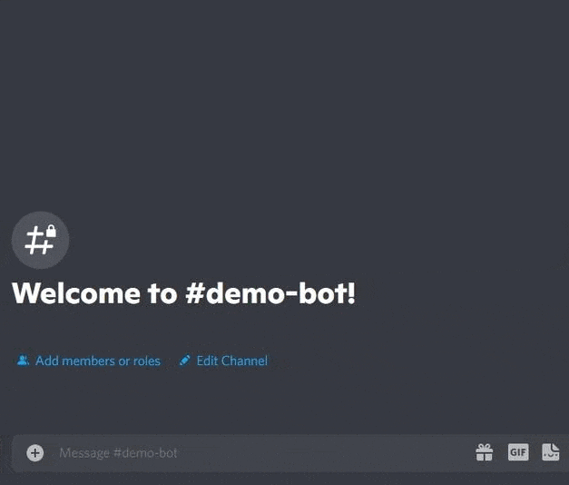

# bot-music-discord
## A simple discord bot for listening music, build with python 3
This bot can stream music on your discord but not only, he also has some other "fun" functions.



### Local installation
- Install Python (version 3.9+)
- Install dependencies/requirements
See the requirements.txt file
- Install ffmpeg binaries
See the website https://ffmpeg.org/
- Complete the .env file
- In your discord bot settings in discord dev platform
Enable PRESENCE INTENT
Enable SERVER MEMBERS INTENT

### Deploy on Fly.io
- Install Fly.io CLI on your local env
- $flyctl auth signup / flyctl auth login
- $fly launch
- Edit your fly.toml file
````
# fly.toml
app = "Your app name here"
kill_signal = "SIGINT"
kill_timeout = 5
processes = []

[env]
````
- $flyctl ips allocate-v4
- $flyctl deploy
- $flyctl secrets set discord_token=the_token_of_your_discord_bot
- $flyctl secrets set bot_command_prefix=a_prefix_like_!
- $flyctl secrets set bot_description=a_bot_description_who_represents_your_bot
- $flyctl secrets set webradio_uri=an_audio_ffmpeg_stream_uri_like_an_icecast2_server_uri
